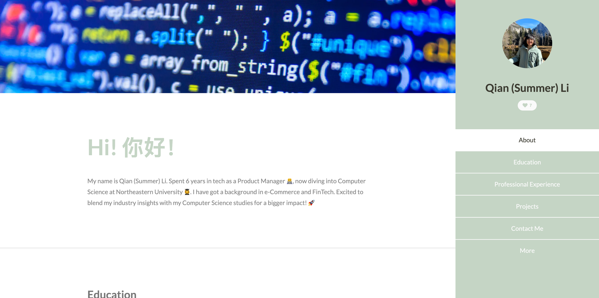
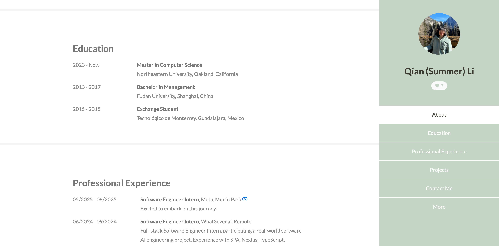
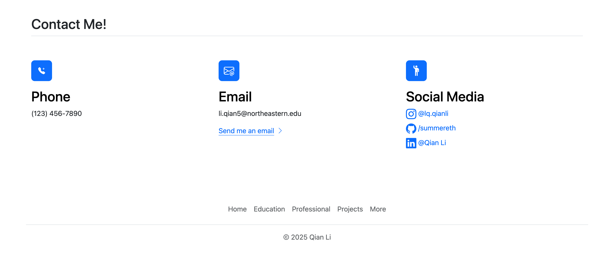

# CS5610_Project1

## Author

Qian (Summer) Li
[Github](https://github.com/summereth)

## Class Link

CS5610 Web Development [Course Page](https://johnguerra.co/classes/webDevelopment_spring_2025/)

Instructor: John Alexis Guerra Gómez [Profile](https://johnguerra.co/)

Provided by Northeastern University, Khoury College of Computer Sciences

## Project Objective

In this assignment you will be implementing your homepage using vanilla HTML5, CSS3 and ES6+. This should be a front-end only static page, so you shouldn't be using a backend or any components libraries.

### Screenshot

#### Homepage

#### Education

#### Contact Page

### Rubics

#### Original Components

- Navigation header with a like button
- 'More' seciton with flex box to demonstrate fun facts about me

#### JS functionality

- A like button in navigation head, that counts how many likes I have received. The data is stored in localStorage. Click the button will increment the like count.

#### HTML pages

- /index.html
- /contactme.html

#### Usage of grid

- `./index.html` 'More' section (`section id="five"`) uses CSS flexbox
- `./contactme.html` 'Contact Me' (`
`) section uses boostrap's `container`, `row` and `col`

## Instructions to build

### Option 1: Live Demo

[Homepage](https://summereth.github.io/CS5610_Project1)

### Option 2: Run locally

#### Step 1

Git clone this repository to your local repository.

#### Step 2

`cd` into this repository and run `reload -b` to start your local server. This webpage will be automatically run in your browser.

If you don't have `http-server` and `reload` installed. Run `sudo npm install -g http-server reload` to install.

## Usage of GenAI

Claude 3.5 Sonnet assisted me in finishing this project.

### Use cases

#### ESLint error analysis

Prompt: help me analyze this error: [Error - 4:22:39 PM] Calculating config file for... (details of error message is omitted)

#### Add like button with counter to header

Prompt: In my html file, add a button in header <section id="header"> add a "like" button to show how many likes I have gotten. You can created related JS file. (html and css files are provided)

#### Adjust stylying of my homepapge

Prompt:

- My phone icon is too small. How to make it bigger like the second example. (html and images are provided)
- How should I adjust my css rule so that .features is a flexbox with several articles inside. Each article takes one row. Inside each article, img element is on the left and .textbox is on the right
- How should I fix this error: Attribute “height” not allowed on element “tr” at this point.error(W3C_validation). My code:`<tr height="15"></tr>`

## Other Documents

- [Google Slides](https://docs.google.com/presentation/d/1LA6EkmrGa7qBwppeXddITQe5W2JPaMPCAO7bhfIutTs/edit?usp=sharing)
- [Video Walkthrough](./images/video1723248301.mp4)
- [Design_Document](./design_doc.md)
