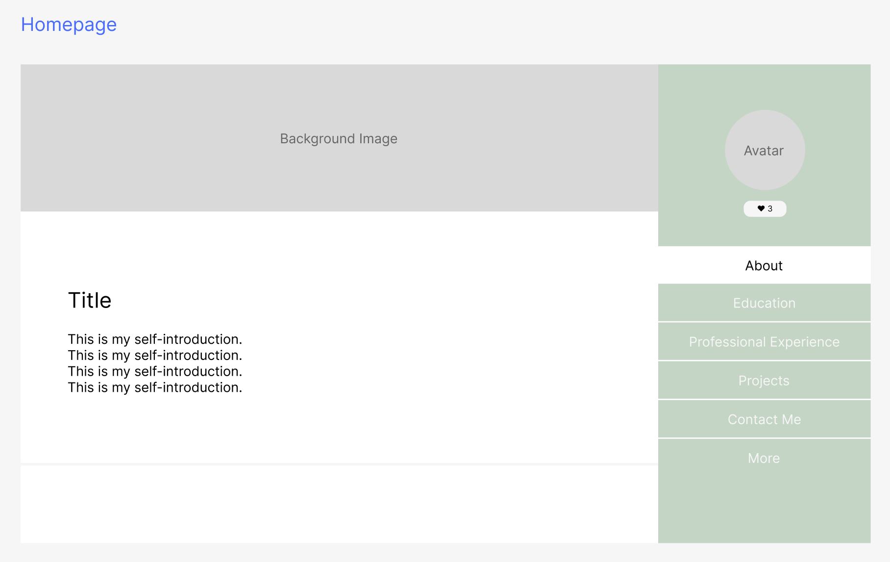
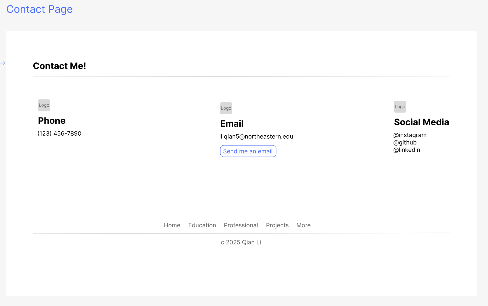

# CS5610_Project1_Design_Document

## Project description
### Overview
A personal profile website that serves as a professional portfolio and personal branding platform. The website consists of two pages: a homepage containing detailed information about professional background and achievements, and a contact page for networking opportunities.

### Technical Stack
- HTML5
- CSS3
- Bootstrap framework for responsive design
- JavaScript for interactive elements

## User Personas
### Professional Recruiter
#### Goals:
- Quickly assess candidate qualifications and experience
- Find concrete examples of past work and projects
- Easily access contact information

#### Pain Points:
- Limited time to review each candidate
- Needs clear, scannable information
- Wants to verify skills and experience quickly

### Fellow Developer
#### Goals:
- Find potential collaboration opportunities
- Learn about technical projects and skills
- Connect for networking purposes

#### Pain Points:
- Interested in technical details of projects
- Wants to understand development approach and methodologies
- Looking for common professional interests

## User stories (use cases but with a story)
### Recruiter Story
Sarah is reviewing candidates for a developer position. She opens the homepage and immediately notices the clean, professional layout. The introduction section gives her a quick overview of skills and experience. She appreciates how the education and professional experience sections are organized chronologically, making it easy to track career progression. The project section provides concrete examples of work, helping her assess technical capabilities. When ready to reach out, she easily navigates to the contact page through the clear navigation menu.

### Developer Story
Jenny discovers the profile while researching potential collaborators for her open-source project. She carefully reviews the technical projects section, noting the technologies used and problem-solving approaches. The education section helps her understand the technical background, while the fun facts section reveals shared interests. She uses the contact page to reach out about possible collaboration, appreciating the multiple contact options provided.

## Design Mockup
Check my [Figma Page](https://www.figma.com/design/hZOJtxIxFm480Q9flBV4eZ/CS5610_Project_Design?node-id=0-1&t=1fNvUCjEIHEpTOVW-1) to view design of user interaction.

### Homepage

### Contact page
